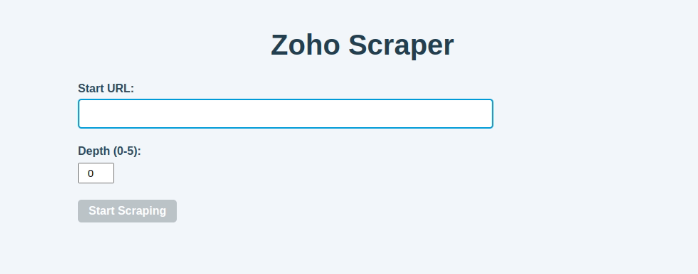

# Zoho Scraper

---

Zoho Scraper is a web scraping application built with FastAPI and Playwright to extract structured data from Zoho help pages (e.g., https://help.zoho.com/portal/en/kb/crm).

It provides an interactive web interface for scraping content, navigating internal links up to a specified depth, and downloading results as a JSON file.

While the application can technically parse other websites, it is specifically optimized for Zoho help pages. As a result, the scraper is unlikely to find or extract meaningful data from non-Zoho websites due to its tailored parsing logic.



---

## Features
- **Interactive Web Interface**: Input a starting URL and depth via a FastAPI-powered form.
- **Depth-Based Crawling**: Follow internal links up to a user-defined depth, with interactive link selection at each level.
- **Structured Data Extraction**: Parse page content into structured items (e.g., text chunks) using custom processing logic.
- **Downloadable Results**: Download results as `scraped_zoho.json` from the results page.
- **User Feedback**: Clear notifications for new links at each depth and error messages if no results or links are found.
- **Responsive Design**: Clean, modern UI with intuitive controls (e.g., "Select All", "Get Results").

---

## Tech Stack
- **Python 3.12**: Core programming language.
- **FastAPI**: Asynchronous web framework for building the API and serving templates.
- **Playwright**: Browser automation tool for dynamic web scraping.
- **Jinja2**: Templating engine for rendering HTML pages.
- **HTML/CSS/JavaScript**: Front-end for the web interface.

---

## How It Works
1. **Start Scraping**: Enter a URL and depth on the home page (`form.html`).
2. **Initial Parse**: The app scrapes the starting page (depth 1), saving results to `scraped_zoho.json`.
3. **Link Selection**: If internal links are found and depth > 1, users are redirected to `select_links.html` to choose links for the next depth, with a message like "New links found at depth X of Y".

4. **Continue or Stop**:
   - Click "Continue Scraping" to parse selected links, returning to `select_links.html` for more links or `scraped_zoho.json` if no links/depth remain.
   - Click "Get Results" (available anytime `scraped_zoho.json` exists) to view results on `scraped_zoho.json`.
5. **View/Download Results**: On `scraped_zoho.json`, view parsed data or download `scraped_zoho.json`. If no results/links are found, a message like "No results or links found" is displayed.

---

## How to Run
You can run Zoho Scraper in two ways:
- Option 1 (Recommended): Using Docker
- Option 2: Using Python directly (Linux preferred; Windows may require additional setup)

**Clone the Repository:**

```bash
git clone https://github.com/prokann02/parsingZoho.git
cd parsingZoho
```

---

### Option 1: Run with Docker (Recommended)

1. Install Docker
Follow instructions at https://docs.docker.com/get-docker/

2. Build the Docker Image:

```bash
docker build -t zoho-Scraper .
```

3. Run the Container:

```bash
docker run -p 8000:8000 zoho-Scraper
```

4. Access the Application:
Open http://localhost:8000 in your browser (http://0.0.0.0:8000).

---

### Option 2: Run with Python (Linux Only Recommended)

Python 3.10-3.12 is required. Running on Windows may cause compatibility issues with Playwright.

1. Create Virtual Environment (Optional but Recommended)

```bash
python -m venv venv
source venv/bin/activate  # On Windows: venv\Scripts\activate
```

2. Install Dependencies:

```bash
pip install --upgrade pip
pip install -r requirements.txt
playwright install
```

3. Start the App:

```bash
uvicorn main:app --host 0.0.0.0 --port 8000 --reload
```

4. Open in Browser

Open http://localhost:8000 in your browser (http://0.0.0.0:8000).

---

## Example Results

```json
[
  {
    "url": "https://help.zoho.com/portal/en/kb/crm/kaizen-series-zoho-crm-developers/sdk/articles/sdk-2023",
    "items": [
      {
        "text": "Kaizen posts 2023: SDK series"
      },
      {
        "text": "Here is a complete list of\nKaizen\nposts related to\nSDKs\npublished in\n2023\n.\nSl. No.\nTitle\nDescription\n1\nPHP SDK - Part I\nLearn how to set up and initialize Zoho CRM's PHP SDK with this step-by-step guide.\n2\nPHP SDK - Part II\nLearn how to perform Record Operations with sample codes in this post. Read more for detailed information on getting started with your SDK journey.\n3\nPHP SDK - Part III\nDiscover new use cases and expand your horizons with additional examples in Record and Send Mail Operations. Read more for further information.\n4\nBulk Read in PHP SDK\nThis post delves into the utilization of bulk read APIs and provides insights into structuring the criteria format for various field data types in PHP SDK, specifically based on v4 APIs.\n5\nPHP SDK V4 - Configuration and Initialization\nLearn to configure and initialize Zoho CRM PHP SDK v4 and v5 for seamless integration.\n6\nQuery API using v5 PHP SDK"
      },
      {
        "text": "Learn in detail about Query APIs, the supported operators for different datatypes, and how to query for data using PHP SDK (v5)\n7\nBulk Write API using PHP SDK (v5) - Part I\nLearn about Bulk Write API in detail, and how to implement the same using PHP SDK.\n8\nBulk Write API using PHP SDK (v5) - Part II\nThis article explain in detail about Bulk Write API, and how to import lookup fields, lookup fields, user lookup fields, subform data and multiselect lookup fields using Bulk Write API, and implement the same using our PHP SDK.\n9\nIntegrating Third Party Application with Zoho CRM using Java SDK\nLearn how to integrate third party applications with Zoho CRM using Java SDK.\nTags :\nzoho developer\nsdk\nzoho crm\nkaizen\nAnu Abraham\nUpdated:\n1 year ago\nHelpful?\n0\n0\nShare :"
      }
    ],
    "category": "Knowledge Base > CRM > Kaizen Series | Zoho CRM Developers > SDK"
  }
]
```
